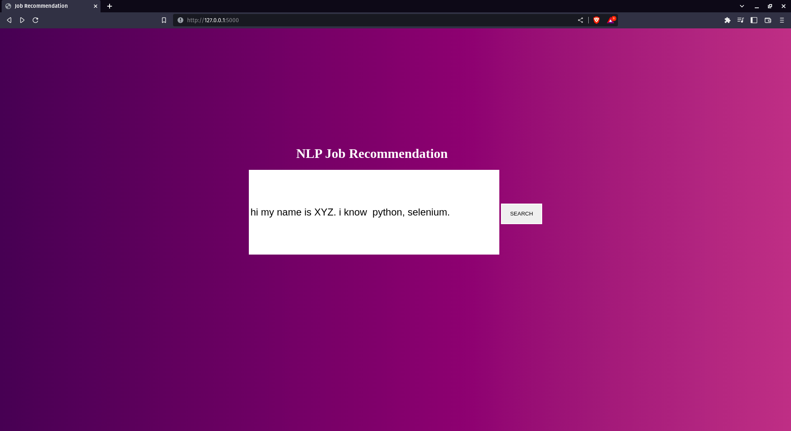
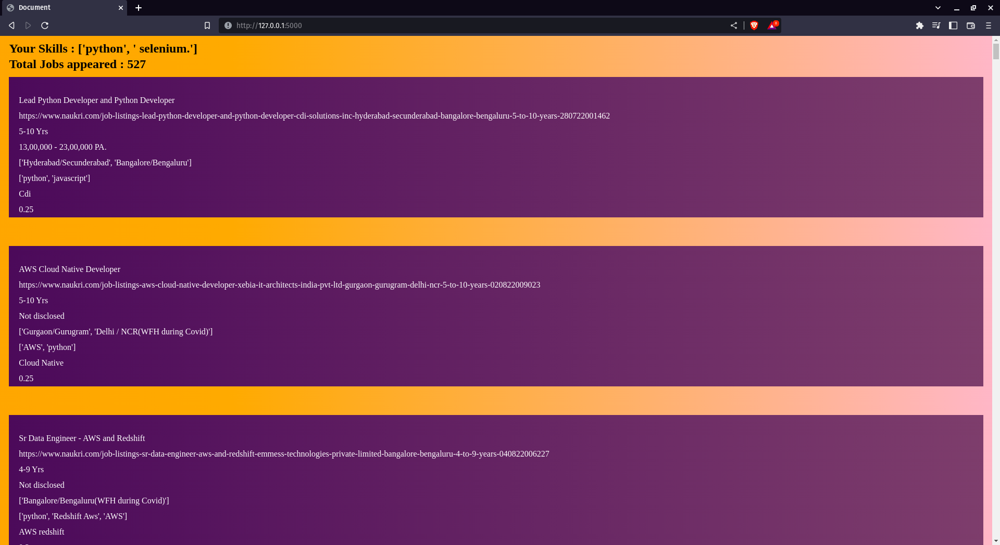

# NLP-Job-Recommendation

Job recommendation system using NLP, in which a user’s description is evaluated via a trained NLP model and jobs are suggested based on the similarities between the user’s skill set and the job’s required skill set. Jobs are scraped from various trustworthy sites in real time using Selenium and stored in a database.

## USER INTERFACE

### HOME PAGE 

### RESULT PAGE

